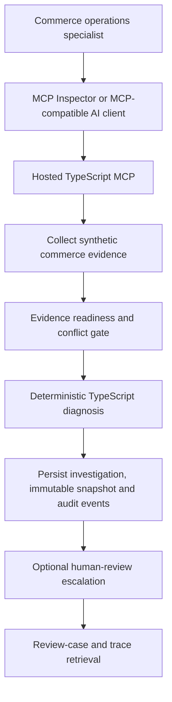

# AI-First Commerce Operations Investigator

A remotely hosted TypeScript MCP that helps a commerce operations specialist answer one bounded question:

> Why has this paid order not reached shipment creation?

The workflow collects synthetic order, payment, inventory, fulfilment, event, and shipment evidence; checks whether that evidence is complete and coherent; applies deterministic TypeScript rules; persists an immutable investigation and audit trail; and can create a human-review escalation. It recommends a next step but never changes commerce state.

## Live review

| Surface | Value |
| --- | --- |
| Health | `https://commerce-mcp.ritikaxg.co.in/health` |
| MCP | `https://commerce-mcp.ritikaxg.co.in/mcp` |
| Transport | Streamable HTTP |
| Authentication | `Authorization: Bearer <reviewer-token>` supplied privately |
| Availability window | Through at least 9 August 2026, or until review is complete |

Start here:

- [Reviewer guide](docs/reviewer-guide.md)
- [Final evaluation](docs/final-evaluation.md)
- [Verification evidence](docs/evidence/final-submission/README.md)
- [Hosted verification PDF](docs/evidence/final-submission/00-hosted-mcp-verification-report.pdf)
- [Engineering decisions and bugs](docs/engineering-decisions.md)
- [AI worklog](docs/ai-worklog.md)

**Demo video:** [To be added before final submission]

## Product workflow



The model is used only for natural-language interaction, approved tool selection, and explanation of validated server results. It does not create business facts, calculate diagnosis, select an arbitrary queue, or mutate commerce data.

## Why MCP is central

- The AI host reaches the workflow through Streamable HTTP MCP, not through workflow or database imports.
- Tool schemas define the complete capability surface and reject unsupported fields.
- Tool descriptions explain side effects, identifiers, and safe retry behavior.
- The server returns versioned structured results and finite safe errors.
- MCP Inspector, Gemini CLI, the direct evaluator, and the model-backed host use the same `/mcp` contract.
- The deterministic MCP remains usable when the external model provider is unavailable.

## Exact MCP tool surface

| Tool | Purpose | Operations write | Commerce write |
| --- | --- | ---: | ---: |
| `list_demo_cases` | Discover the approved synthetic cases | No | No |
| `investigate_order_exception` | Collect evidence, diagnose, and persist the investigation | Yes | No |
| `create_human_review_escalation` | Create or reuse a server-derived human-review case | Yes | No |
| `get_review_case` | Read a persisted review case and source investigation | No | No |
| `get_investigation_trace` | Read the investigation, immutable evidence, and ordered audit events | No | No |

Investigation and escalation write workflow records only. The MCP exposes no order update, inventory reservation, warehouse reassignment, fulfilment retry, shipment creation, SQL, reset, or unrestricted HTTP tool.

## Data and safety boundary

```text
commerce schema - runtime SELECT only
- orders and order items
- payments
- warehouses and source-specific inventory observations
- fulfilments and fulfilment events
- shipments

operations schema - scoped workflow writes
- investigations
- immutable evidence snapshots
- human-review escalations
- idempotency records
- append-only audit events
```

The running API uses a restricted PostgreSQL role and cannot insert, update, or delete commerce records. Every investigation and escalation response states `commerceStateChanged=false`.

## Approved synthetic scenarios

| Order | Evidence | Expected outcome | Human-review queue |
| --- | --- | --- | --- |
| `ORD-1042` | Complete | Assigned warehouse out of stock; `WH-B` is eligible | `FULFILMENT_OPERATIONS` |
| `ORD-1043` | Complete | Fulfilment creation failed | `FULFILMENT_OPERATIONS` |
| `ORD-1044` | Complete | Within expected processing time | None |
| `ORD-1045` | Complete | Shipment-label creation failed | `SHIPPING_OPERATIONS` |
| `ORD-1046` | Missing | `NEEDS_MORE_INFO`; no diagnosis | `OPERATIONS_DATA_REVIEW` |
| `ORD-1047` | Complete | Shipment already exists | None |
| `ORD-1048` | Complete | Cause not determined | `GENERAL_COMMERCE_OPERATIONS` |
| `ORD-1049` | Complete | Payment not confirmed | `PAYMENT_OPERATIONS` |
| `ORD-1050` | Conflicting | `NEEDS_MORE_INFO`; no diagnosis | `OPERATIONS_DATA_REVIEW` |

The fixtures use a fixed reference time and contain no real customer data. See the [approved scenario contract](docs/scenarios/approved-synthetic-scenarios.md).

## Verification summary

| Verification layer | Result |
| --- | --- |
| Static and regression CI | PASS |
| Direct protocol-level MCP evaluation | PASS |
| All nine synthetic scenarios | PASS |
| Hosted provider-independent MCP verification | PASS |
| Hosted model-backed verification | PASS |
| MCP Inspector | PASS |
| Gemini CLI as an independent MCP-compatible AI client | PASS |
| Hosted-safe database verification | 3 pass, 0 fail |
| Runtime credential isolation | PASS |
| Commerce state unchanged | PASS |

### MCP Inspector: exact five-tool discovery


### MCP-compatible AI client: grounded hosted result


## Important tradeoffs and limitations

- **Deterministic diagnosis:** results are testable and auditable, but adding a diagnosis requires a reviewed code change.
- **Immutable decision-time evidence:** newer source evidence is evaluated through a new investigation rather than rewriting history.
- **No automatic operational fix:** the workflow stops at a recommendation and optional human-review case.
- **Sequential Gemini requests:** reduces free-tier rate-limit pressure but increases latency and limits throughput.
- **Bounded retries:** exhausted daily or project quota still returns a provider error.
- **Shared reviewer bearer token:** suitable for a bounded review window, not individual production identity.
- **Single EC2 and PostgreSQL deployment:** intentionally simple and continuously available, but without automated failover.
- **Synthetic fixed dataset:** repeatable for evaluation, not a production commerce integration.
- **No frontend:** reviewers interact through MCP Inspector or an MCP-compatible AI client.

## Documentation

- [Reviewer guide](docs/reviewer-guide.md)
- [Final evaluation](docs/final-evaluation.md)
- [Engineering decisions and bug report](docs/engineering-decisions.md)
- [AI worklog](docs/ai-worklog.md)
- [Workflow contract](docs/workflow-contract.md)
- [Approved PostgreSQL schema](docs/database/schema-proposal.md)
- [Approved synthetic scenarios](docs/scenarios/approved-synthetic-scenarios.md)
- [Architecture and package graph](docs/architecture/package-graph.md)
- [AWS deployment guide](docs/deployment/aws-ec2.md)
- [Detailed Phase 12 report](docs/evaluations/phase-12-hosted-mcp.md)

## Final submission checklist

- [x] Hosted MCP URL
- [x] Source repository
- [x] Concise README
- [x] Product decisions, assumptions, and exclusions
- [x] Focused tests and runtime verification
- [x] MCP Inspector verification
- [x] MCP-compatible AI-client verification
- [x] AI worklog
- [x] Reviewer token-sharing process
- [ ] Four-to-five-minute demo video
