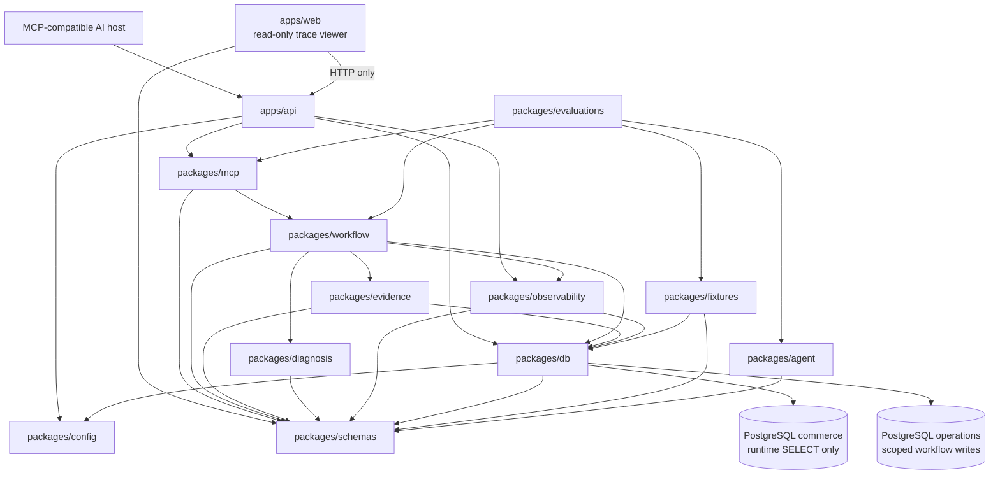

# Package Graph

## Status and scope

This Phase 0 document freezes dependency direction and ownership. Phase 2 scaffolded every listed application/package boundary. Phase 3 added shared scenario/fixture schemas, typed fixtures, pure validation, and a Prisma-private transactional demo-data boundary. Phase 5 adds plain commerce source-record contracts and a restricted read-only repository facade. Evidence collection, diagnosis, workflow persistence, MCP, agent, and trace signatures remain deferred.

## Dependency direction

The diagram shows the primary allowed relationships. The ownership table below is authoritative for allowed imports. Arrows mean "may depend on or call"; the browser-to-API arrow is an HTTP relationship, not a source-code import.

## Ownership and allowed imports

| Component                | Owns                                                                                         | May import                                                |
| ------------------------ | -------------------------------------------------------------------------------------------- | --------------------------------------------------------- |
| `apps/api`               | Express composition, `/health`, `/mcp`, and read-only trace/investigation/case routes        | `config`, `db`, `mcp`, `observability`                    |
| `apps/web`               | Minimal Tailwind read-only trace viewer                                                      | Shared response types from `schemas`; API over HTTP       |
| `packages/config`        | Shared TypeScript, environment, and test configuration                                       | No domain/runtime package                                 |
| `packages/schemas`       | Zod schemas and public protocol/domain types                                                 | No infrastructure package                                 |
| `packages/db`            | Prisma, migrations, database clients, transactions, repository contracts and implementations | `config`, `schemas`                                       |
| `packages/fixtures`      | Typed synthetic cases, fixture validation, and explicit seed/reset helpers                   | `schemas`, `db`                                           |
| `packages/evidence`      | Evidence collection, source normalization, source timestamps, and warehouse eligibility      | `schemas`, repository contracts from `db`                 |
| `packages/diagnosis`     | Evidence readiness/conflict gate and deterministic diagnosis rules                           | `schemas` only                                            |
| `packages/observability` | Internal trace event vocabulary, safe summaries, and trace queries                           | `schemas`, repository contracts from `db`                 |
| `packages/workflow`      | Investigation and escalation orchestration, persistence, idempotency, and audit coordination | `schemas`, `db`, `evidence`, `diagnosis`, `observability` |
| `packages/mcp`           | Approved tool registration, descriptions, input/output adapters, and MCP error mapping       | `schemas`, `workflow`                                     |
| `packages/agent`         | Host-neutral tool-use/explanation/refusal instructions and model-evaluation helpers          | `schemas`                                                 |
| `packages/evaluations`   | Scenario, guardrail, contract, and model evaluations                                         | Runtime packages under test, `fixtures`, and `agent`      |

## Planned public surfaces

These names describe ownership and dependency seams. Phase 3 now implements the fixture-related surfaces listed below; later runtime signatures remain conceptual.

| Owner           | Conceptual public surface                                                                                                          |
| --------------- | ---------------------------------------------------------------------------------------------------------------------------------- |
| `schemas`       | Zod scenario, fixture, JSON-value, and commerce source-record contracts now; normalized evidence and workflow contracts later      |
| `db`            | Transactional demo operations plus `CommerceReadRepository` and the workflow repository context; workflow-write repositories later |
| `fixtures`      | Frozen scenario manifest, typed commerce evidence, fixed clock, pure validation, and explicit seed/reset composition               |
| `evidence`      | `EvidenceCollector` returning a normalized order investigation snapshot                                                            |
| `diagnosis`     | `EvidenceReadinessEvaluator` and `DiagnosisEngine`                                                                                 |
| `observability` | Safe trace event writer contract and read-only trace queries                                                                       |
| `workflow`      | `InvestigationWorkflow` and `HumanReviewWorkflow`                                                                                  |
| `mcp`           | Registration for the five approved domain tools                                                                                    |
| `agent`         | Host-neutral instructions and evaluation case adapters                                                                             |

Rules for later public APIs:

- Validate untrusted/external values with Zod contracts from `packages/schemas`.
- Export supported APIs from package roots; do not expose arbitrary internal paths.
- Do not expose the Prisma client outside `packages/db`.
- Do not put business rules in repositories, MCP adapters, applications, or the LLM.
- Do not add a generic utility/package dependency merely to avoid choosing an owner.

## Acyclic layering

The graph has this topological direction:

1. `config`, `schemas`
2. `db`, `diagnosis`, `agent`
3. `fixtures`, `evidence`, `observability`
4. `workflow`
5. `mcp`
6. `apps/api`
7. `apps/web` over HTTP and `evaluations` as top-level consumers

No lower layer imports a higher layer. In particular:

- packages never import application code;
- `db` does not import `evidence`, `diagnosis`, `workflow`, or `mcp`;
- `evidence` consumes repository contracts without importing Prisma;
- `diagnosis` imports schemas only;
- `workflow` does not import MCP or application code;
- runtime packages never import `evaluations`; and
- `apps/web` never accesses PostgreSQL directly.

## Current repository differences

| Current state                                            | Contract treatment                                                                                    |
| -------------------------------------------------------- | ----------------------------------------------------------------------------------------------------- |
| `apps/api` provides Express composition/health           | MCP, trace routes, workflow composition, and database access remain deferred.                         |
| `apps/web` is a static Tailwind shell                    | It remains secondary and has no API/database integration before the trace phase.                      |
| `packages/ui` has no `src/` directory                    | Starter components are retained but are not part of the product-domain graph.                         |
| `packages/db` owns Prisma, demo data, and commerce reads | Prisma stays private; the public read facade uses only the restricted workflow connection.            |
| `packages/schemas` owns source and fixture Zod contracts | Later normalized evidence/workflow contracts must extend this package without infrastructure imports. |
| `packages/fixtures` depends on `schemas` and `db`        | It validates before invoking the explicit seed/reset boundary; `db` never imports `fixtures`.         |
| Remaining target package roots exist                     | They deliberately export nothing until the phase that owns their contracts and behavior.              |
| `@repo/config` exports API/database environment parsing  | Database URL validation is shared, while credentials remain local and ignored.                        |
| Internal workspace packages export TypeScript source     | Bun resolves package-root source directly; generated `dist` files are not workspace entry points.     |
| `apps/api` produces a bundled Node-targeted artifact     | Bun performs the build, while Node.js remains the Express production runtime.                         |

`apps/docs` was removed by the user after Phase 0 review because it has no product responsibility.

## Rejected dependency alternatives

- App code shared by importing from `apps/*` into packages.
- Prisma imports in `diagnosis`, `evidence`, `workflow`, MCP adapters, or the web app.
- Repository interfaces owned by `evidence` when that would force `db` to import upward and create a cycle.
- Direct database access from `apps/web`.
- Business-rule duplication across MCP adapters, routes, and model instructions.
- Redis, queues, Kafka, RAG, multi-agent orchestration, or event sourcing in the initial graph.

## Change control

Later phases may refine names or split an interface when implementation evidence requires it. Any changed dependency direction, new package, or expanded public surface must be recorded in `AGENTS.md` and the relevant phase evaluation report before acceptance.
