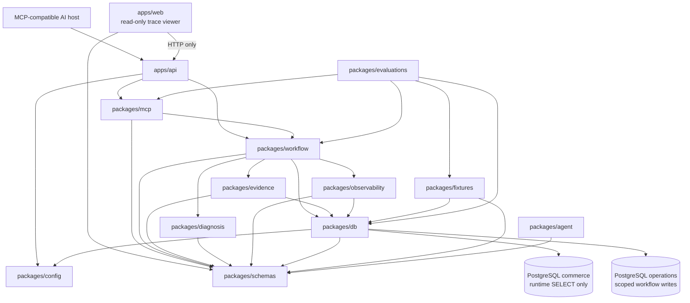

# Package Graph

## Status

Phases 0 through 9 implement the deterministic commerce-operations workflow. Phase 10 adds the remote MCP adapter, Streamable HTTP API composition, strict MCP contracts, and direct protocol evaluation. Actual LLM/AI-host behavior remains Phase 11 work.

## Dependency direction



Arrows mean source-code dependency unless explicitly labelled HTTP. Browser code never imports API or database runtime code.

## Ownership

| Component | Owns | May import |
| --- | --- | --- |
| `apps/api` | Express composition, `/health`, `/mcp`, Host validation, MCP transport lifecycle, graceful shutdown | `config`, `mcp`, `workflow` |
| `apps/web` | Later minimal read-only trace viewer | shared schemas and API over HTTP |
| `packages/config` | Environment and shared configuration parsing | no domain runtime package |
| `packages/schemas` | Public Zod and TypeScript contracts | no infrastructure package |
| `packages/db` | Prisma, migrations, database clients, transactions, repository contracts and implementations | `config`, `schemas` |
| `packages/fixtures` | Frozen scenarios, fixture validation, explicit seed/reset/verify | `schemas`, `db` |
| `packages/evidence` | Evidence collection and source-read metadata | `schemas`, repository contracts from `db` |
| `packages/diagnosis` | Readiness, conflicts, deterministic diagnosis | `schemas` only |
| `packages/observability` | Safe audit builders and trace queries | `schemas`, repository contracts from `db` |
| `packages/workflow` | Investigation/escalation orchestration, persistence, idempotency, audit coordination, demo catalog | `schemas`, `db`, `evidence`, `diagnosis`, `observability` |
| `packages/mcp` | Exact five tool registrations, descriptions, annotations, adapters, safe error mapping, stateless transport handler | `schemas`, `workflow`, official MCP SDK |
| `packages/evaluations` | Direct MCP protocol evaluation and later model evaluations | top-level runtime packages under test, `fixtures`, `db/testing` |
| `packages/agent` | Phase 11 provider-neutral model instructions and evaluation helpers | `schemas` |

## Implemented Phase 10 surface

`packages/mcp` exposes:

```ts
createCommerceOperationsMcpServer({ workflow })
handleCommerceOperationsMcpHttpRequest(request, response, { workflow })
MCP_TOOL_NAMES
```

The server registers exactly:

- `list_demo_cases`
- `investigate_order_exception`
- `create_human_review_escalation`
- `get_review_case`
- `get_investigation_trace`

`apps/api` mounts the stateless Streamable HTTP endpoint at `/mcp`. It lazily creates one workflow context, validates the Host header before MCP processing, limits JSON bodies, maps malformed transport requests safely, and disconnects the workflow context during shutdown.

`packages/evaluations` owns the explicit serial evaluator. It builds and starts the real API, connects through the official MCP client and `StreamableHTTPClientTransport`, runs all nine scenarios, verifies persistence and idempotency, tests forbidden tools and invalid inputs, compares commerce before/after, and clears operations rows in `finally`.

## Acyclic layering

The topological direction is:

1. `config`, `schemas`
2. `db`, `diagnosis`, `agent`
3. `fixtures`, `evidence`, `observability`
4. `workflow`
5. `mcp`
6. `apps/api`
7. `apps/web` over HTTP and `evaluations` as top-level consumers

Permanent rules:

- packages never import applications;
- Prisma imports remain inside `packages/db`;
- diagnosis imports schemas only;
- workflow never imports MCP or application code;
- MCP never imports DB, fixtures, evidence, diagnosis internals, observability internals, agent, evaluations, or applications;
- runtime packages never import evaluations;
- web code never accesses PostgreSQL directly;
- business rules are not duplicated in repositories, MCP adapters, API routes, or model instructions.

## Phase 11 handoff

The future AI host connects to `/mcp`, discovers the five tools, selects and orders them, and explains strict structured results. Phase 11 may add one provider implementation behind a provider-neutral interface plus model-backed tool-selection, explanation, refusal, and adversarial evaluations. It must not move business diagnosis or escalation logic into the model.
