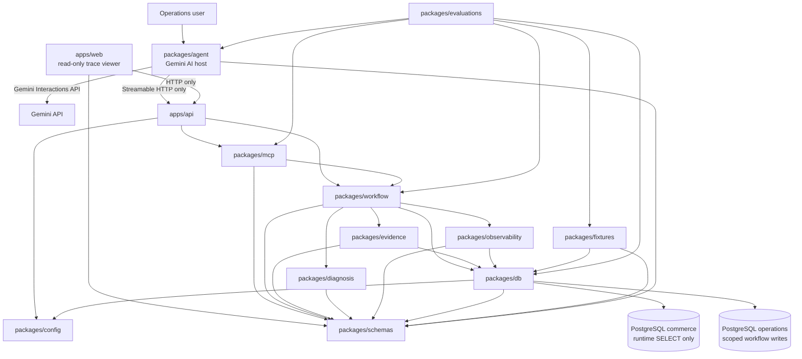

# Package Graph

## Status

Phases 0 through 9 implement the deterministic commerce-operations workflow. Phase 10 adds the remote MCP adapter, Streamable HTTP API composition, strict MCP contracts, and direct protocol evaluation. Phase 11 adds a provider-neutral Gemini AI host and explicit model-backed evaluation without moving business decisions into the model.

## Dependency direction



Arrows mean source-code dependency unless labelled HTTP or Gemini API. `packages/agent` does not import the API application, MCP server, workflow, database, fixtures, evidence, diagnosis, or observability implementation. It reaches the workflow only through the remote MCP protocol. Browser code never imports API or database runtime code.

## Ownership

| Component                | Owns                                                                                                                                                                                                                                  | May import                                                |
| ------------------------ | ------------------------------------------------------------------------------------------------------------------------------------------------------------------------------------------------------------------------------------- | --------------------------------------------------------- |
| `apps/api`               | Express composition, `/health`, `/mcp`, Host validation, MCP transport lifecycle, graceful shutdown                                                                                                                                   | `config`, `mcp`, `workflow`                               |
| `apps/web`               | Later minimal read-only trace viewer                                                                                                                                                                                                  | shared schemas and API over HTTP                          |
| `packages/config`        | Environment and shared configuration parsing                                                                                                                                                                                          | no domain runtime package                                 |
| `packages/schemas`       | Public Zod and TypeScript contracts                                                                                                                                                                                                   | no infrastructure package                                 |
| `packages/db`            | Prisma, migrations, database clients, transactions, repository contracts and implementations                                                                                                                                          | `config`, `schemas`                                       |
| `packages/fixtures`      | Frozen scenarios, fixture validation, explicit seed/reset/verify                                                                                                                                                                      | `schemas`, `db`                                           |
| `packages/evidence`      | Evidence collection and source-read metadata                                                                                                                                                                                          | `schemas`, repository contracts from `db`                 |
| `packages/diagnosis`     | Readiness, conflicts, deterministic diagnosis                                                                                                                                                                                         | `schemas` only                                            |
| `packages/observability` | Safe audit builders and trace queries                                                                                                                                                                                                 | `schemas`, repository contracts from `db`                 |
| `packages/workflow`      | Investigation/escalation orchestration, persistence, idempotency, audit coordination, demo catalog                                                                                                                                    | `schemas`, `db`, `evidence`, `diagnosis`, `observability` |
| `packages/mcp`           | Exact five tool registrations, descriptions, annotations, adapters, safe error mapping, stateless transport handler                                                                                                                   | `schemas`, `workflow`, official MCP SDK                   |
| `packages/agent`         | Provider-neutral model interface, Gemini provider, system policy, exact MCP discovery, model-facing tool projection, host-generated identifiers, bounded tool loop, compact result projection, grounding gate, CLI, model smoke check | `schemas`, official MCP client SDK, `@google/genai`       |
| `packages/evaluations`   | Direct MCP evaluation and explicit live Gemini model evaluation                                                                                                                                                                       | top-level packages under test, `fixtures`, `db/testing`   |

## Implemented MCP surface

`packages/mcp` exposes:

```ts
createCommerceOperationsMcpServer({ workflow });
handleCommerceOperationsMcpHttpRequest(request, response, { workflow });
MCP_TOOL_NAMES;
```

The server registers exactly:

- `list_demo_cases`
- `investigate_order_exception`
- `create_human_review_escalation`
- `get_review_case`
- `get_investigation_trace`

`apps/api` mounts the stateless Streamable HTTP endpoint at `/mcp`. It lazily creates one workflow context, validates the Host header before MCP processing, limits JSON bodies, maps malformed transport requests safely, and disconnects the workflow context during shutdown.

## Implemented Phase 11 surface

`packages/agent` exposes a provider-neutral `ModelProvider` and one `GeminiModelProvider`. The runtime flow is:

```text
natural-language request
        ↓
deterministic intent/refusal preflight
        ↓
exact five-tool MCP discovery
        ↓
Gemini selects one model-facing tool
        ↓
host validates arguments and injects reliability IDs
        ↓
real Streamable HTTP MCP call
        ↓
compact allowlisted result projection
        ↓
Gemini structured explanation
        ↓
deterministic grounding validation
        ↓
authoritative result assembly
```

The model-facing investigation schema includes only `orderId`; the host injects `clientRequestId` and the investigation idempotency key. The model-facing escalation schema includes only `investigationId`; the host injects a distinct escalation key.

The agent refuses commerce-mutation intent before model or MCP execution. A combined investigation/escalation request runs sequentially and escalates only when the persisted investigation says human action is required. Every public result states `commerceStateChanged=false`.

`packages/evaluations` owns both explicit serial boundaries:

- `eval:mcp:direct` tests the protocol and deterministic workflow without a model;
- `eval:agent:gemini` tests the real Gemini model, tool selection, ordering, grounding, refusal, prompt injection, stability, token usage, commerce immutability, and cleanup.

## Acyclic layering

The topological direction is:

1. `config`, `schemas`
2. `db`, `diagnosis`, `agent`
3. `fixtures`, `evidence`, `observability`
4. `workflow`
5. `mcp`
6. `apps/api`
7. `apps/web` over HTTP and `evaluations` as top-level consumers

Permanent rules:

- packages never import applications;
- Prisma imports remain inside `packages/db`;
- diagnosis imports schemas only;
- workflow never imports MCP, agent, or application code;
- MCP never imports DB, fixtures, evidence, diagnosis internals, observability internals, agent, evaluations, or applications;
- agent never imports workflow, MCP server implementation, DB, fixtures, evidence, diagnosis, observability internals, applications, or evaluations;
- runtime packages never import evaluations;
- web code never accesses PostgreSQL or Gemini directly;
- business rules are not duplicated in repositories, MCP adapters, API routes, model provider code, or system instructions.

## Hosted staging handoff

After the local live Gemini suite passes, the same agent can point to a protected HTTPS MCP endpoint through `MCP_SERVER_URL` and optional `MCP_AUTH_BEARER_TOKEN`. The first protected staging deployment occurs before Phase 12. Phase 12 adds the read-only trace API/viewer, and Phase 13 finalizes authentication, deployment hardening, and client submission evidence.
