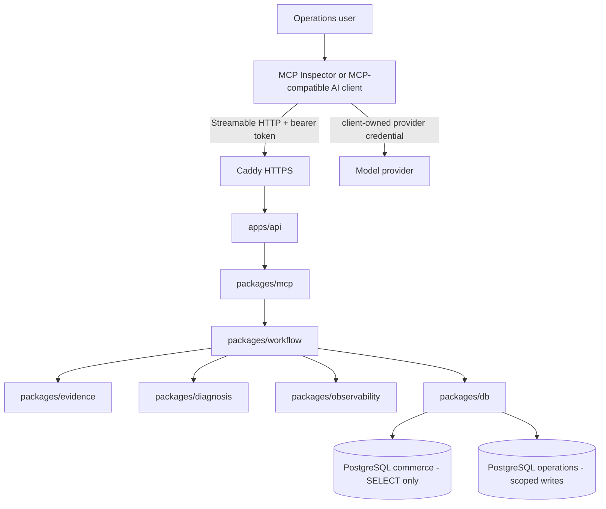
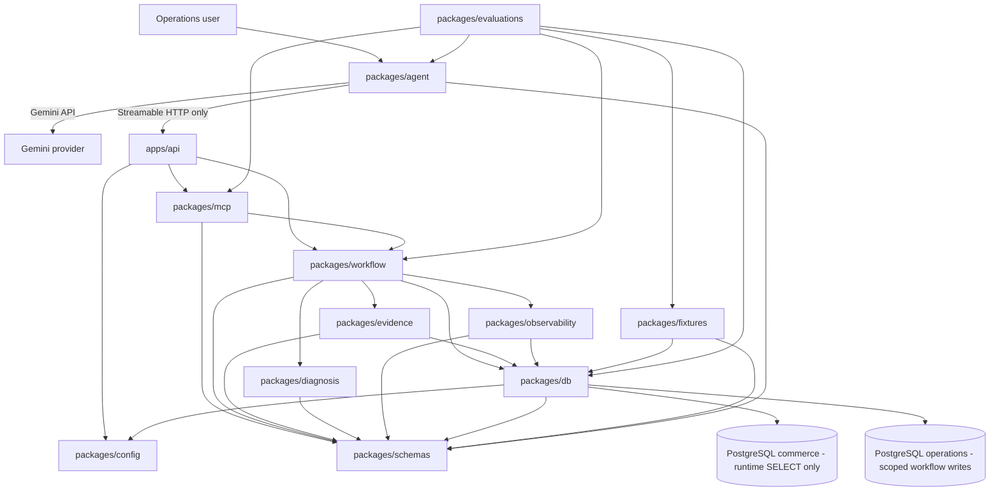

# Package Graph

## Status

Phases 0 through 12 are complete and merged. The repository contains the deterministic commerce-operations workflow, remote authenticated MCP, provider-neutral Gemini AI host, hosted AWS deployment, and direct plus model-backed verification.

The final submission packaging changes documentation and redacted evidence only. They do not change the dependency graph or deployed runtime.

## Product and deployment path



The model provider and the hosted MCP are separate availability and credential boundaries. No model-provider key is installed on the EC2 MCP server.

## Source-code dependency direction



Arrows mean source-code dependency unless labelled HTTP or provider API. `packages/agent` does not import workflow internals, MCP server implementation, database code, Prisma, evidence, diagnosis, fixtures, or observability. It reaches the product workflow through the remote MCP protocol.

## Ownership

| Component                | Owns                                                                                                                                                                | May import                                                               |
| ------------------------ | ------------------------------------------------------------------------------------------------------------------------------------------------------------------- | ------------------------------------------------------------------------ |
| `apps/api`               | Express composition, `/health`, authenticated `/mcp`, Host validation, MCP transport lifecycle, graceful shutdown                                                   | `config`, `mcp`, `workflow`                                              |
| `packages/config`        | Environment and shared configuration parsing                                                                                                                        | No domain runtime package                                                |
| `packages/schemas`       | Public Zod and TypeScript contracts                                                                                                                                 | No infrastructure package                                                |
| `packages/db`            | Prisma, migrations, database clients, transactions, repository contracts and implementations                                                                        | `config`, `schemas`                                                      |
| `packages/fixtures`      | Frozen scenarios, fixture validation, explicit seed/reset/verify                                                                                                    | `schemas`, `db`                                                          |
| `packages/evidence`      | Evidence collection and source-read metadata                                                                                                                        | `schemas`, repository contracts from `db`                                |
| `packages/diagnosis`     | Readiness, conflicts, deterministic diagnosis                                                                                                                       | `schemas` only                                                           |
| `packages/observability` | Safe audit builders and trace queries                                                                                                                               | `schemas`, repository contracts from `db`                                |
| `packages/workflow`      | Investigation/escalation orchestration, persistence, idempotency, audit coordination, demo catalog                                                                  | `schemas`, `db`, `evidence`, `diagnosis`, `observability`                |
| `packages/mcp`           | Exact five tool registrations, descriptions, annotations, adapters, safe error mapping, stateless transport handler                                                 | `schemas`, `workflow`, official MCP SDK                                  |
| `packages/agent`         | Provider-neutral model interface, Gemini provider, MCP discovery, model-facing projection, host-generated identifiers, bounded tool loop, grounding validation, CLI | `schemas`, official MCP client SDK, `@google/genai`                      |
| `packages/evaluations`   | Direct MCP, hosted MCP, hosted AI, scenario, and safety verification                                                                                                | Top-level packages under test, `fixtures`, owner-only DB testing helpers |

## Exact MCP surface

`packages/mcp` exposes:

```ts
createCommerceOperationsMcpServer({ workflow });
handleCommerceOperationsMcpHttpRequest(request, response, { workflow });
MCP_TOOL_NAMES;
```

The server registers exactly:

- `list_demo_cases`
- `investigate_order_exception`
- `create_human_review_escalation`
- `get_review_case`
- `get_investigation_trace`

`apps/api` mounts the stateless Streamable HTTP endpoint at `/mcp`. It validates the Host header and bearer token before constructing the workflow context, limits JSON bodies, maps malformed requests safely, and closes resources during shutdown.

## Model-backed path

```text
natural-language request
        ↓
deterministic intent/refusal preflight
        ↓
exact five-tool MCP discovery
        ↓
model selects one approved tool
        ↓
host validates arguments and injects reliability IDs
        ↓
remote Streamable HTTP MCP call
        ↓
compact allowlisted result projection
        ↓
model structured explanation
        ↓
deterministic grounding validation
        ↓
authoritative result assembly
```

The model-facing investigation schema includes only `orderId`; trusted host code injects `clientRequestId` and the investigation idempotency key. The model-facing escalation schema includes only `investigationId`; the host injects a separate escalation key.

A compatible third-party AI client can also connect directly to the hosted MCP and generate its own accepted identifiers, as demonstrated with Gemini CLI.

## Acyclic layering

The topological direction is:

1. `config`, `schemas`
2. `db`, `diagnosis`, `agent`
3. `fixtures`, `evidence`, `observability`
4. `workflow`
5. `mcp`
6. `apps/api`
7. `evaluations` as top-level consumers

Permanent rules:

- packages never import applications;
- Prisma imports remain inside `packages/db`;
- diagnosis imports schemas only;
- workflow never imports MCP, agent, or application code;
- MCP never imports DB, fixtures, evidence, diagnosis internals, observability internals, agent, evaluations, or applications;
- agent never imports workflow, MCP server implementation, DB, fixtures, evidence, diagnosis, observability internals, applications, or evaluations;
- runtime packages never import evaluations;
- business rules are not duplicated in MCP adapters, API routes, model provider code, or system instructions.

## Hosted runtime boundary

```text
Internet
  -> Caddy :443
  -> API :3000 (internal only)
  -> PostgreSQL :5432 (internal only)
```

The production API container receives:

```text
NODE_ENV
PORT
MCP_ALLOWED_HOSTS
MCP_API_KEY
WORKFLOW_DATABASE_URL
```

It does not receive:

```text
DATABASE_URL
DEMO_DATABASE_URL
MODEL_API_KEY
```

The deployment and external-client evidence are documented in:

- [Reviewer guide](../reviewer-guide.md)
- [Final evaluation](../final-evaluation.md)
- [Phase 12 hosted report](../evaluations/phase-12-hosted-mcp.md)
