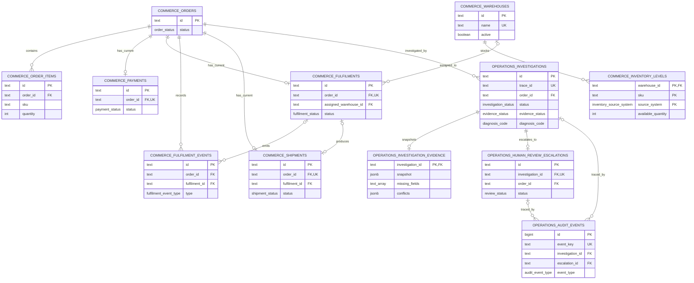

# Approved Scoped PostgreSQL Schema

## Review status

**Status: Accepted on 2026-07-30; amended by the approved Phase 3 scenario contract on 2026-07-30**

This document is the accepted Phase 1 database design and the source of truth for later Prisma models, PostgreSQL migrations, repositories, seed data, and permission tests. Phase 1 did not modify the existing Prisma schema or authorize implementation work.

The Phase 3 scenario amendment changes inventory from one warehouse/SKU row to source-specific observations keyed by `(warehouse_id, sku, source_system)`. This is required to persist the approved `ORD-1050` conflict and was approved with the final scenario matrix. No other entity boundary changed.

## 1. Scope and safety boundary

The product answers one bounded question:

> Why has this paid order not reached shipment creation?

The database is separated into two PostgreSQL schemas:

| Schema       | Purpose                                                                                                                    | Runtime boundary                                                           |
| ------------ | -------------------------------------------------------------------------------------------------------------------------- | -------------------------------------------------------------------------- |
| `commerce`   | Synthetic operational order, payment, warehouse, inventory, fulfilment, event, and shipment evidence.                      | Runtime `SELECT` only.                                                     |
| `operations` | Investigations, immutable evidence snapshots, human-review escalations, idempotency records, and append-only audit events. | Minimum workflow `SELECT`/`INSERT` and narrowly scoped lifecycle `UPDATE`. |

Creating an investigation or human-review escalation is an allowed workflow write. No runtime role, repository, transaction, route, model, or MCP tool may insert, update, or delete `commerce` records.

The workflow recommends a next step for human review. It never reserves inventory, changes a warehouse assignment, releases a hold, retries fulfilment, creates a shipment, or claims that any operational action occurred.

Every investigation and escalation response must state `commerceStateChanged=false`.

## 2. Design conventions

- Identifiers use PostgreSQL `text` so the synthetic IDs remain readable (`ORD-1042`, `INV-2001`, `TRACE-2001`, `CASE-2001`). When implemented in Prisma, these columns use the Prisma `String` type (`@db.Text` is optional because PostgreSQL `text` is its default mapping). A later production system could use UUIDs without changing entity boundaries.
- All timestamps use `timestamptz` and are stored in UTC.
- Statuses use schema-owned PostgreSQL enum types. The finite values make invalid state impossible at the database boundary; adding a value requires a reviewed migration.
- External/provider references are nullable but unique when present.
- Foreign keys use `ON DELETE RESTRICT`. Runtime roles have no delete permission.
- JSONB is used only for evolving evidence and safe audit summaries. Common lookup fields remain relational and indexed.
- `created_at` values default to `transaction_timestamp()` in the future migration. Source observation times are supplied by the evidence source and never defaulted silently.
- The Prisma scaffold remained unchanged during Phase 1. The approved Phase 3 prompt later absorbed the minimum schema migration needed to seed and test the final synthetic scenarios. Remaining role/permission and cross-table trigger hardening stays gated for the reconciled database-hardening phase.

## 3. Enum catalogue

### 3.1 Commerce enums

| Enum                               | Values                                                                                                                             | Use                                                             |
| ---------------------------------- | ---------------------------------------------------------------------------------------------------------------------------------- | --------------------------------------------------------------- |
| `commerce.order_status`            | `CONFIRMED`, `PROCESSING`                                                                                                          | Current scoped order state needed by the synthetic scenarios.   |
| `commerce.payment_status`          | `SUCCEEDED`, `PROCESSING`, `FAILED`                                                                                                | Current payment source-of-truth state.                          |
| `commerce.inventory_source_system` | `WAREHOUSE_SYSTEM`, `COMMERCE_SYSTEM`                                                                                              | Identifies independent persisted inventory observations.        |
| `commerce.fulfilment_status`       | `PENDING`, `PROCESSING`, `ON_HOLD`, `FAILED`                                                                                       | Current scoped fulfilment state.                                |
| `commerce.fulfilment_hold_reason`  | `INVENTORY_OUT_OF_STOCK`, `OTHER`                                                                                                  | Nullable reason when a fulfilment is on hold.                   |
| `commerce.fulfilment_event_type`   | `FULFILMENT_CREATED`, `FULFILMENT_CREATION_FAILED`, `PROCESSING_STARTED`, `INVENTORY_HOLD_ADDED`, `SHIPMENT_LABEL_CREATION_FAILED` | Progression and failure facts needed by the approved scenarios. |
| `commerce.fulfilment_event_status` | `SUCCEEDED`, `FAILED`                                                                                                              | Outcome of the recorded event.                                  |
| `commerce.shipment_status`         | `CREATED`, `IN_TRANSIT`, `DELIVERED`                                                                                               | Current scoped shipment state when a shipment exists.           |

These are intentionally not a complete commerce lifecycle. New operational states require evidence that the bounded workflow needs them.

### 3.2 Operations enums

| Enum                                   | Values                                                                                                                                                                                                                    | Use                                                                                                                                                     |
| -------------------------------------- | ------------------------------------------------------------------------------------------------------------------------------------------------------------------------------------------------------------------------- | ------------------------------------------------------------------------------------------------------------------------------------------------------- |
| `operations.investigation_status`      | `RUNNING`, `COMPLETED`, `NEEDS_MORE_INFO`, `FAILED`                                                                                                                                                                       | Workflow lifecycle only.                                                                                                                                |
| `operations.evidence_status`           | `COMPLETE`, `MISSING`, `CONFLICTING`                                                                                                                                                                                      | Whether deterministic diagnosis is safe.                                                                                                                |
| `operations.diagnosis_code`            | `ASSIGNED_WAREHOUSE_OUT_OF_STOCK`, `FULFILMENT_CREATION_FAILED`, `WITHIN_EXPECTED_PROCESSING_TIME`, `SHIPMENT_LABEL_CREATION_FAILED`, `SHIPMENT_ALREADY_EXISTS`, `PAYMENT_NOT_CONFIRMED`, `CAUSE_NOT_DETERMINED`          | Business outcome, separate from workflow status.                                                                                                        |
| `operations.diagnosis_confidence`      | `CONFIRMED`                                                                                                                                                                                                               | The scoped workflow issues only deterministic, evidence-complete diagnoses.                                                                             |
| `operations.review_status`             | `AWAITING_REVIEW`, `IN_REVIEW`, `CLOSED`                                                                                                                                                                                  | Human-review lifecycle.                                                                                                                                 |
| `operations.review_queue`              | `FULFILMENT_OPERATIONS`, `SHIPPING_OPERATIONS`, `PAYMENT_OPERATIONS`, `OPERATIONS_DATA_REVIEW`, `GENERAL_COMMERCE_OPERATIONS`                                                                                             | Explicit human ownership.                                                                                                                               |
| `operations.review_reason_code`        | `ASSIGNED_WAREHOUSE_OUT_OF_STOCK`, `FULFILMENT_CREATION_FAILED`, `SHIPMENT_LABEL_CREATION_FAILED`, `SHIPMENT_ALREADY_EXISTS`, `PAYMENT_NOT_CONFIRMED`, `CAUSE_NOT_DETERMINED`, `MISSING_EVIDENCE`, `CONFLICTING_EVIDENCE` | Supports actionable diagnosed and uncertainty-based handoffs without inventing a diagnosis. `WITHIN_EXPECTED_PROCESSING_TIME` is deliberately excluded. |
| `operations.idempotency_resource_type` | `INVESTIGATION`, `HUMAN_REVIEW_ESCALATION`                                                                                                                                                                                | Type of persisted resource returned by a retried request.                                                                                               |
| `operations.audit_status`              | `STARTED`, `SUCCEEDED`, `FAILED`                                                                                                                                                                                          | Outcome of an observable workflow step.                                                                                                                 |
| `operations.audit_event_type`          | Listed below                                                                                                                                                                                                              | Stable vocabulary for trace reconstruction.                                                                                                             |

Approved `operations.audit_event_type` values:

- `INVESTIGATION_STARTED`
- `INVESTIGATION_FAILED`
- `TOOL_CALL_STARTED`
- `ORDER_FETCHED`
- `PAYMENT_FETCHED`
- `FULFILMENT_FETCHED`
- `INVENTORY_FETCHED`
- `SHIPMENT_CHECKED`
- `EVENTS_FETCHED`
- `EVIDENCE_VALIDATED`
- `DIAGNOSIS_MATCHED`
- `INVESTIGATION_PERSISTED`
- `TOOL_CALL_SUCCEEDED`
- `TOOL_CALL_FAILED`
- `HUMAN_REVIEW_CASE_CREATED`
- `HUMAN_REVIEW_CASE_REUSED`

Audit event types describe observable actions, not hidden model reasoning.

## 4. Commerce entities

The runtime reads these tables. A separate demo seed/reset role may write them outside the running workflow.

### 4.1 `commerce.orders`

Purpose: one synthetic order and its current scoped state.

| Column       | Type                    | Nullable | Key / constraint           | Rationale                        |
| ------------ | ----------------------- | -------- | -------------------------- | -------------------------------- |
| `id`         | `text`                  | No       | Primary key                | Human-readable order identifier. |
| `status`     | `commerce.order_status` | No       |                            | Current order state.             |
| `created_at` | `timestamptz`           | No       |                            | Source creation time.            |
| `updated_at` | `timestamptz`           | No       | `updated_at >= created_at` | Current source update time.      |

It belongs in scope because every investigation and workflow record is anchored to an existing order.

### 4.2 `commerce.order_items`

Purpose: the SKUs and quantities that inventory must satisfy.

| Column       | Type          | Nullable | Key / constraint                  | Rationale                        |
| ------------ | ------------- | -------- | --------------------------------- | -------------------------------- |
| `id`         | `text`        | No       | Primary key                       | Stable line identifier.          |
| `order_id`   | `text`        | No       | FK to `commerce.orders(id)`       | Parent order.                    |
| `sku`        | `text`        | No       | Unique with `order_id`; non-empty | Inventory lookup key.            |
| `quantity`   | `integer`     | No       | `quantity > 0`                    | Required quantity for this line. |
| `created_at` | `timestamptz` | No       |                                   | Source creation time.            |

`UNIQUE (order_id, sku)` intentionally collapses duplicate SKU lines for the synthetic workflow and makes eligibility checks deterministic.

### 4.3 `commerce.payments`

Purpose: the one current payment source-of-truth record for an order.

| Column               | Type                      | Nullable | Key / constraint                    | Rationale                                   |
| -------------------- | ------------------------- | -------- | ----------------------------------- | ------------------------------------------- |
| `id`                 | `text`                    | No       | Primary key                         | Payment identifier.                         |
| `order_id`           | `text`                    | No       | Unique; FK to `commerce.orders(id)` | At most one current payment per order.      |
| `status`             | `commerce.payment_status` | No       |                                     | Determines whether payment is confirmed.    |
| `amount`             | `numeric(12,2)`           | No       | `amount >= 0`                       | Scoped monetary evidence.                   |
| `currency`           | `char(3)`                 | No       | Uppercase ISO-style code check      | Currency context.                           |
| `provider_reference` | `text`                    | Yes      | Unique when present                 | Prevents duplicate imported source records. |
| `observed_at`        | `timestamptz`             | No       |                                     | When payment state was observed.            |

Physical cardinality is `orders 1 -> 0..1 payments`: the maximum is one current record, while an absent row can represent missing payment evidence. Payment-attempt history is deferred.

### 4.4 `commerce.warehouses`

Purpose: valid inventory and fulfilment locations.

| Column       | Type          | Nullable | Key / constraint  | Rationale                                          |
| ------------ | ------------- | -------- | ----------------- | -------------------------------------------------- |
| `id`         | `text`        | No       | Primary key       | Warehouse identifier.                              |
| `name`       | `text`        | No       | Unique; non-empty | Human-readable location.                           |
| `active`     | `boolean`     | No       |                   | Inactive warehouses are not eligible alternatives. |
| `created_at` | `timestamptz` | No       |                   | Source creation time.                              |

### 4.5 `commerce.inventory_levels`

Purpose: source-specific current stock evidence for a SKU at a warehouse.

| Column               | Type                               | Nullable | Key / constraint                              | Rationale                        |
| -------------------- | ---------------------------------- | -------- | --------------------------------------------- | -------------------------------- |
| `warehouse_id`       | `text`                             | No       | Composite PK; FK to `commerce.warehouses(id)` | Inventory location.              |
| `sku`                | `text`                             | No       | Composite PK; non-empty                       | Inventory item.                  |
| `source_system`      | `commerce.inventory_source_system` | No       | Composite PK                                  | Independent observation source.  |
| `available_quantity` | `integer`                          | No       | `available_quantity >= 0`                     | Source-reported available stock. |
| `observed_at`        | `timestamptz`                      | No       |                                               | Evidence freshness.              |

The primary key is `(warehouse_id, sku, source_system)`. An absent required observation is distinguishable from a row with zero quantity and is treated as missing evidence, not out-of-stock evidence. Multiple sources may coexist; disagreeing quantities remain separate persisted observations and produce `CONFLICTING` evidence.

### 4.6 `commerce.fulfilments`

Purpose: one current scoped fulfilment and its assigned warehouse/hold state.

| Column                  | Type                              | Nullable | Key / constraint                    | Rationale                                   |
| ----------------------- | --------------------------------- | -------- | ----------------------------------- | ------------------------------------------- |
| `id`                    | `text`                            | No       | Primary key; unique with `order_id` | Fulfilment identifier.                      |
| `order_id`              | `text`                            | No       | Unique; FK to `commerce.orders(id)` | At most one current fulfilment per order.   |
| `status`                | `commerce.fulfilment_status`      | No       |                                     | Current fulfilment state.                   |
| `hold_reason`           | `commerce.fulfilment_hold_reason` | Yes      | Required when `status = ON_HOLD`    | Explains a hold without free-form guessing. |
| `assigned_warehouse_id` | `text`                            | Yes      | FK to `commerce.warehouses(id)`     | May be absent before assignment/creation.   |
| `provider_reference`    | `text`                            | Yes      | Unique when present                 | Unique source-system reference.             |
| `created_at`            | `timestamptz`                     | No       |                                     | Source creation time.                       |
| `updated_at`            | `timestamptz`                     | No       | `updated_at >= created_at`          | Current source update time.                 |
| `observed_at`           | `timestamptz`                     | No       |                                     | Evidence observation time.                  |

Physical cardinality is `orders 1 -> 0..1 fulfilments`. A creation failure may be represented by an event without a fulfilment row.

### 4.7 `commerce.fulfilment_events`

Purpose: ordered progression and failure evidence, including creation and label failures.

| Column                   | Type                               | Nullable | Key / constraint                                                     | Rationale                                          |
| ------------------------ | ---------------------------------- | -------- | -------------------------------------------------------------------- | -------------------------------------------------- |
| `id`                     | `text`                             | No       | Primary key                                                          | Event identifier.                                  |
| `order_id`               | `text`                             | No       | FK to `commerce.orders(id)`                                          | Events remain queryable when no fulfilment exists. |
| `fulfilment_id`          | `text`                             | Yes      | Composite FK with `order_id` to `commerce.fulfilments(id, order_id)` | When present, guarantees event/order consistency.  |
| `source_event_reference` | `text`                             | Yes      | Unique when present                                                  | Prevents duplicate imported events.                |
| `type`                   | `commerce.fulfilment_event_type`   | No       |                                                                      | Stable event meaning.                              |
| `status`                 | `commerce.fulfilment_event_status` | No       |                                                                      | Event outcome.                                     |
| `details`                | `jsonb`                            | No       | JSON object; default `{}`                                            | Small, safe provider-specific facts.               |
| `occurred_at`            | `timestamptz`                      | No       |                                                                      | Deterministic event ordering.                      |

`fulfilment_id` is nullable because `FULFILMENT_CREATION_FAILED` can exist without a successfully created fulfilment.

### 4.8 `commerce.shipments`

Purpose: shipment existence and current scoped state.

| Column               | Type                       | Nullable | Key / constraint                                                     | Rationale                                                  |
| -------------------- | -------------------------- | -------- | -------------------------------------------------------------------- | ---------------------------------------------------------- |
| `id`                 | `text`                     | No       | Primary key                                                          | Shipment identifier.                                       |
| `order_id`           | `text`                     | No       | Unique; FK to `commerce.orders(id)`                                  | At most one current shipment per order.                    |
| `fulfilment_id`      | `text`                     | Yes      | Composite FK with `order_id` to `commerce.fulfilments(id, order_id)` | Links a shipment to the correct fulfilment when available. |
| `status`             | `commerce.shipment_status` | No       |                                                                      | Current shipment state.                                    |
| `provider_reference` | `text`                     | Yes      | Unique when present                                                  | Unique source-system reference.                            |
| `created_at`         | `timestamptz`              | No       |                                                                      | Shipment creation evidence.                                |
| `observed_at`        | `timestamptz`              | No       |                                                                      | Evidence observation time.                                 |

Physical cardinality is `orders 1 -> 0..1 shipments`. No row means a successful shipment lookup found no shipment; a source-read failure is represented separately in the evidence snapshot.

## 5. Operations-workflow entities

These tables persist investigation and review activity. They never represent a change to commerce state.

### 5.1 `operations.investigations`

Purpose: one investigation lifecycle and its searchable outcome.

| Column                | Type                              | Nullable | Key / constraint               | Rationale                                          |
| --------------------- | --------------------------------- | -------- | ------------------------------ | -------------------------------------------------- |
| `id`                  | `text`                            | No       | Primary key                    | Investigation identifier.                          |
| `trace_id`            | `text`                            | No       | Unique                         | Stable trace lookup.                               |
| `order_id`            | `text`                            | No       | FK to `commerce.orders(id)`    | Existing investigated order.                       |
| `client_request_id`   | `text`                            | No       | Unique                         | Prevents duplicate logical investigation requests. |
| `status`              | `operations.investigation_status` | No       |                                | Workflow lifecycle.                                |
| `evidence_status`     | `operations.evidence_status`      | Yes      | Terminal-state checks below    | Nullable while evidence is not yet available.      |
| `diagnosis_code`      | `operations.diagnosis_code`       | Yes      | Terminal-state checks below    | Business outcome, never guessed.                   |
| `confidence`          | `operations.diagnosis_confidence` | Yes      | Required with diagnosis        | Deterministic rule confidence.                     |
| `matched_rule`        | `text`                            | Yes      | Required with diagnosis        | Versioned TypeScript rule identifier.              |
| `suggested_queue`     | `operations.review_queue`         | Yes      |                                | Derived human ownership.                           |
| `suggested_next_step` | `text`                            | Yes      |                                | Server-produced review guidance.                   |
| `error_code`          | `text`                            | Yes      | Required for `FAILED`          | Safe technical classification.                     |
| `created_at`          | `timestamptz`                     | No       |                                | Investigation start time.                          |
| `updated_at`          | `timestamptz`                     | No       | `updated_at >= created_at`     | Last lifecycle update.                             |
| `completed_at`        | `timestamptz`                     | Yes      | Required for terminal statuses | Terminal timestamp.                                |

Searchable top-level fields avoid JSONB scans for common order, status, trace, and outcome queries.

### 5.2 `operations.investigation_evidence`

Purpose: one immutable, normalized evidence snapshot exactly as observed at decision time.

| Column                    | Type          | Nullable | Key / constraint                             | Rationale                                                              |
| ------------------------- | ------------- | -------- | -------------------------------------------- | ---------------------------------------------------------------------- |
| `investigation_id`        | `text`        | No       | PK and FK to `operations.investigations(id)` | One snapshot per investigation.                                        |
| `snapshot_schema_version` | `smallint`    | No       | `> 0`; default `1`                           | Allows compatible snapshot evolution.                                  |
| `snapshot`                | `jsonb`       | No       | JSON object                                  | Normalized order/payment/inventory/fulfilment/event/shipment evidence. |
| `missing_fields`          | `text[]`      | No       | Default empty array                          | Machine-readable missing paths.                                        |
| `conflicts`               | `jsonb`       | No       | JSON array; default `[]`                     | Structured conflicting values and sources.                             |
| `source_observed_at`      | `jsonb`       | No       | JSON object                                  | Source-by-source timestamps/errors.                                    |
| `created_at`              | `timestamptz` | No       |                                              | Snapshot creation time.                                                |

The runtime receives `SELECT` and `INSERT`, but no `UPDATE` or `DELETE`, on this table. The snapshot is immutable from insertion; terminal investigations must have exactly one snapshot.

### 5.3 `operations.human_review_escalations`

Purpose: persistent human-review handoff derived from a stored investigation.

| Column                | Type                            | Nullable | Key / constraint                              | Rationale                                                       |
| --------------------- | ------------------------------- | -------- | --------------------------------------------- | --------------------------------------------------------------- |
| `id`                  | `text`                          | No       | Primary key                                   | Case identifier.                                                |
| `investigation_id`    | `text`                          | No       | Unique; FK to `operations.investigations(id)` | Scoped choice: at most one case per investigation.              |
| `order_id`            | `text`                          | No       | FK to `commerce.orders(id)`                   | Fast case/order lookup; must match the investigation.           |
| `status`              | `operations.review_status`      | No       |                                               | Human-review lifecycle.                                         |
| `queue`               | `operations.review_queue`       | No       |                                               | Human owner derived by the workflow.                            |
| `reason_code`         | `operations.review_reason_code` | No       |                                               | Diagnosis or explicit uncertainty reason.                       |
| `suggested_next_step` | `text`                          | No       |                                               | Copied from the stored investigation, not submitted by the LLM. |
| `dedupe_key`          | `text`                          | No       | Unique                                        | Stable logical case identity.                                   |
| `created_at`          | `timestamptz`                   | No       |                                               | Case creation time.                                             |
| `updated_at`          | `timestamptz`                   | No       | `updated_at >= created_at`                    | Review lifecycle update time.                                   |
| `closed_at`           | `timestamptz`                   | Yes      | Required only for `CLOSED`                    | Closure time.                                                   |

The approved design permits one escalation over the lifetime of an investigation. A repeated escalation request returns the same case, including after closure. Reopening a closed case is out of scope.

A case may be created only when the stored outcome requires human action and provides a server-derived queue and next step. Eligible outcomes include `NEEDS_MORE_INFO` caused by missing or conflicting evidence. `WITHIN_EXPECTED_PROCESSING_TIME` is not eligible merely because the order remains within the expected window.

### 5.4 `operations.idempotency_records`

Purpose: return the same logical result after safe client/network retries.

| Column              | Type                                   | Nullable | Key / constraint                        | Rationale                                         |
| ------------------- | -------------------------------------- | -------- | --------------------------------------- | ------------------------------------------------- |
| `tool_name`         | `text`                                 | No       | Composite PK                            | Idempotency scope.                                |
| `idempotency_key`   | `text`                                 | No       | Composite PK                            | Caller-supplied retry key.                        |
| `request_hash`      | `char(64)`                             | No       | Lowercase SHA-256 hex check             | Detects key reuse with different input.           |
| `resource_type`     | `operations.idempotency_resource_type` | No       |                                         | Identifies returned resource kind.                |
| `resource_id`       | `text`                                 | No       | Verified by deferred constraint trigger | Investigation or escalation identifier.           |
| `response_snapshot` | `jsonb`                                | No       | JSON object                             | Exact safe structured response returned on retry. |
| `created_at`        | `timestamptz`                          | No       |                                         | Idempotency record creation time.                 |

Primary key: `(tool_name, idempotency_key)`.

Retry rules:

1. A new key inserts the resource and idempotency record in one transaction.
2. The same key and canonical request hash returns the stored resource/response without a second effect.
3. The same key with a different request hash returns `IDEMPOTENCY_KEY_REUSE` and creates nothing.
4. The request hash excludes transport-only volatile metadata and secrets.

### 5.5 `operations.audit_events`

Purpose: append-only observable tool and deterministic workflow activity.

| Column                | Type                          | Nullable | Key / constraint                                | Rationale                                                   |
| --------------------- | ----------------------------- | -------- | ----------------------------------------------- | ----------------------------------------------------------- |
| `id`                  | `bigint` identity             | No       | Primary key                                     | Stable tie-breaker and efficient ordering.                  |
| `event_key`           | `text`                        | No       | Unique                                          | Prevents duplicate logical audit events.                    |
| `trace_id`            | `text`                        | No       | Indexed                                         | Trace lookup, including events before resource persistence. |
| `investigation_id`    | `text`                        | Yes      | FK to `operations.investigations(id)`           | Nullable for the earliest tool event.                       |
| `escalation_id`       | `text`                        | Yes      | FK to `operations.human_review_escalations(id)` | Present for case events.                                    |
| `event_type`          | `operations.audit_event_type` | No       |                                                 | Observable action vocabulary.                               |
| `tool_name`           | `text`                        | Yes      |                                                 | MCP tool when applicable.                                   |
| `status`              | `operations.audit_status`     | No       |                                                 | Step outcome.                                               |
| `safe_input_summary`  | `jsonb`                       | Yes      | JSON object                                     | Redacted observable input summary.                          |
| `safe_output_summary` | `jsonb`                       | Yes      | JSON object                                     | Redacted structured result summary.                         |
| `error_code`          | `text`                        | Yes      |                                                 | Safe failure classification.                                |
| `duration_ms`         | `integer`                     | Yes      | `duration_ms >= 0`                              | Step duration.                                              |
| `created_at`          | `timestamptz`                 | No       |                                                 | Audit ordering time.                                        |

The runtime receives `SELECT` and `INSERT`, but no `UPDATE` or `DELETE`, on this table.

## 6. Relationships and cardinality



`operations.idempotency_records` is intentionally omitted from the ER lines because `resource_id` is polymorphic. Its composite primary key and a deferred constraint trigger validate the referenced investigation or escalation without a misleading dual foreign key.

### Scoped current-record choice

- Payment: zero or one current row per order.
- Fulfilment: zero or one current row per order.
- Shipment: zero or one current row per order.

This is sufficient for the assignment and allows missing records to remain observable. Provider payment attempts, multiple fulfilments, split shipments, and detailed state history are future extensions. `commerce.fulfilment_events` preserves the progression/failure evidence needed now.

During `RUNNING`, an investigation may temporarily have no evidence row. `COMPLETED` and `NEEDS_MORE_INFO` require exactly one evidence row. The scoped model allows at most one human-review escalation per investigation.

## 7. Invariants and enforcement

| Invariant                                                                                                                | Required enforcement                                                                                                                           |
| ------------------------------------------------------------------------------------------------------------------------ | ---------------------------------------------------------------------------------------------------------------------------------------------- |
| Order-item quantities are positive.                                                                                      | `CHECK (quantity > 0)`.                                                                                                                        |
| Inventory is non-negative.                                                                                               | `CHECK (available_quantity >= 0)`.                                                                                                             |
| External source references are unique when present.                                                                      | Nullable `UNIQUE` constraints on provider/event references.                                                                                    |
| An event/shipment cannot point to a fulfilment for another order.                                                        | Composite foreign keys using `(fulfilment_id, order_id)`.                                                                                      |
| An investigation references an existing order.                                                                           | FK `operations.investigations.order_id -> commerce.orders.id`.                                                                                 |
| `COMPLETED` requires `COMPLETE` evidence, diagnosis, confidence, matched rule, and `completed_at`; `error_code` is null. | Same-row `CHECK` plus deferred cross-table constraint trigger requiring one evidence row with empty missing/conflict arrays.                   |
| `NEEDS_MORE_INFO` requires `MISSING` or `CONFLICTING`, no diagnosis/confidence/matched rule, and `completed_at`.         | Same-row `CHECK` plus deferred constraint trigger requiring non-empty `missing_fields` for `MISSING` or non-empty conflicts for `CONFLICTING`. |
| `FAILED` has no diagnosis and has `error_code` plus `completed_at`.                                                      | Same-row `CHECK`.                                                                                                                              |
| `RUNNING` has no terminal timestamp or diagnosis.                                                                        | Same-row `CHECK`.                                                                                                                              |
| Missing/conflicting evidence cannot produce a recommendation that depends on uncertain facts.                            | Database blocks diagnosis; deterministic TypeScript permits only evidence-verification guidance, covered by guardrail tests.                   |
| Evidence is immutable.                                                                                                   | Runtime has no `UPDATE`/`DELETE` grant on `investigation_evidence`; optional defensive trigger rejects mutation.                               |
| Audit events are append-only.                                                                                            | Runtime has no `UPDATE`/`DELETE` grant on `audit_events`; `event_key` is unique.                                                               |
| Escalation data is derived from the stored investigation.                                                                | Service accepts only investigation ID/idempotency key; deferred trigger validates matching order and reason category.                          |
| Escalation requires a human-action outcome; `WITHIN_EXPECTED_PROCESSING_TIME` alone is ineligible.                       | Service eligibility rule requires a derived queue/next step; enum omission and a deferred trigger reject the non-actionable reason.            |
| Closed cases have a close time; open cases do not.                                                                       | `CHECK` tying `status` to `closed_at`.                                                                                                         |
| Duplicate escalation is prevented.                                                                                       | `UNIQUE (investigation_id)` and `UNIQUE (dedupe_key)`.                                                                                         |
| Idempotency is per tool and key.                                                                                         | Composite PK `(tool_name, idempotency_key)` plus request-hash comparison before effects.                                                       |
| Polymorphic idempotency resources exist.                                                                                 | Deferred constraint trigger validates `resource_type`/`resource_id`.                                                                           |
| Runtime cannot mutate commerce.                                                                                          | Grants/revokes and an integration test that attempts forbidden DML.                                                                            |

The cross-table constraint triggers are PostgreSQL migration details for Phase 4. They are documented now because Prisma schema syntax alone cannot enforce terminal-state/evidence consistency.

## 8. Permissions

Approved role separation:

| Role                  | `commerce`                             | `operations`                                                              | Intended use                                               |
| --------------------- | -------------------------------------- | ------------------------------------------------------------------------- | ---------------------------------------------------------- |
| Schema owner/migrator | DDL and controlled DML                 | DDL and controlled DML                                                    | Migration process only; credentials never used by runtime. |
| Demo seed/reset role  | `SELECT`, `INSERT`, `UPDATE`, `DELETE` | No workflow DML                                                           | Explicit fixture seed/reset commands only.                 |
| Workflow runtime role | `SELECT` only                          | Narrow permissions below                                                  | Investigation/MCP application connection.                  |
| Human reviewer role   | No direct access required              | `SELECT` investigations/evidence/cases; column-level case-status `UPDATE` | Human review lifecycle, if implemented.                    |

Workflow runtime grants:

- `USAGE` on `commerce` and `operations`.
- `SELECT` on all scoped `commerce` tables.
- `SELECT` and `INSERT` on all five `operations` tables.
- Column-level `UPDATE` on investigation lifecycle/result fields only.
- No `UPDATE`/`DELETE` on evidence, idempotency, or audit tables.
- No `UPDATE` on human-review cases from the MCP workflow; a separate reviewer role may update only `status`, `updated_at`, and `closed_at`.
- `USAGE` on the audit identity sequence only.
- No schema `CREATE`, no function execution beyond explicitly granted workflow constraints, and no access through a raw SQL tool.

Revoke schema/table privileges from `PUBLIC`. Later permission tests must connect as the actual runtime role and prove commerce DML fails.

## 9. Required indexes and query paths

Primary keys and unique constraints create their own indexes. PostgreSQL does not automatically index every foreign key, so explicit child/query indexes remain necessary.

| Query path                          | Required index / constraint                                                                          | Why now                                                        |
| ----------------------------------- | ---------------------------------------------------------------------------------------------------- | -------------------------------------------------------------- |
| Order lookup                        | `commerce.orders(id)` PK                                                                             | Direct investigation input.                                    |
| Order items                         | `UNIQUE commerce.order_items(order_id, sku)`                                                         | Evidence collection by order and deterministic SKU uniqueness. |
| Current payment/fulfilment/shipment | Unique `order_id` on each current table                                                              | Enforces maximum one and supports lookup.                      |
| Alternative warehouse stock         | `commerce.inventory_levels(sku, warehouse_id)`                                                       | Find every source observation for eligible warehouses/SKUs.    |
| Assigned fulfilments                | `commerce.fulfilments(assigned_warehouse_id, order_id)`                                              | Warehouse evidence and diagnostics.                            |
| Ordered events                      | `commerce.fulfilment_events(order_id, occurred_at, id)`                                              | Deterministic order trace.                                     |
| Fulfilment events                   | `commerce.fulfilment_events(fulfilment_id, occurred_at, id)`                                         | Scoped fulfilment history.                                     |
| Trace lookup                        | Unique `operations.investigations(trace_id)` and `operations.audit_events(trace_id, created_at, id)` | Reconstruct one trace.                                         |
| Investigation retry                 | Unique `operations.investigations(client_request_id)`                                                | Reuse one investigation.                                       |
| Order investigations                | `operations.investigations(order_id, created_at DESC, id)`                                           | Recent investigations for an order.                            |
| Workflow queue                      | `operations.investigations(status, created_at, id)`                                                  | Find running/uncertain investigations.                         |
| Review case lookup                  | Unique `investigation_id`; unique `dedupe_key`                                                       | Prevent duplicate case effects.                                |
| Open review queue                   | `operations.human_review_escalations(queue, status, created_at, id)`                                 | Human work queue.                                              |
| Idempotency lookup                  | PK `operations.idempotency_records(tool_name, idempotency_key)`                                      | Retry path.                                                    |
| Investigation audit order           | `operations.audit_events(investigation_id, created_at, id)`                                          | Investigation trace.                                           |
| Escalation audit order              | `operations.audit_events(escalation_id, created_at, id)`                                             | Case trace.                                                    |

Deferred until evidence justifies them:

- GIN indexes on snapshot/audit JSONB;
- table partitioning, BRIN indexes, archival, and retention jobs;
- provider-history indexes;
- multi-tenant composite indexes;
- full-text search and analytics replicas.

The prototype query paths use relational fields; indexing evolving JSONB prematurely would add write/maintenance cost without a demonstrated query.

## 10. Snapshot and audit rationale

The normalized evidence is stored as one immutable JSONB snapshot because:

- the exact decision-time facts survive later source changes;
- source adapters can evolve without a migration for every nested field;
- missing/error markers and per-source observation times remain together;
- one snapshot is easy to return in a trace or evaluation; and
- searchable outcome fields remain on `operations.investigations`.

The snapshot contains normalized facts, not raw provider payloads. `snapshot_schema_version` supports evolution and replay-compatible interpretation.

Traceability is split deliberately:

- `investigations`: order, lifecycle, evidence state, diagnosis, confidence, matched rule, suggested queue/step, safe error code;
- `investigation_evidence`: normalized snapshot, source times/errors, missing fields, conflicts;
- `audit_events`: tool name, event type, status, duration, safe input/output summaries, and errors;
- `human_review_escalations`: whether a case exists, why, where it is queued, and its lifecycle;
- `idempotency_records`: whether a retry returned an existing effect.

Raw prompts, secrets, credentials, unrestricted provider payloads, and hidden chain of thought are never stored.

## 11. Walkthrough: ORD-1042

### 11.1 Commerce evidence

| Table                        | Representative record                                                   |
| ---------------------------- | ----------------------------------------------------------------------- |
| `commerce.orders`            | `ORD-1042`, `CONFIRMED`                                                 |
| `commerce.order_items`       | `ITEM-1042-1`, `ORD-1042`, `SKU-RED-SHOE-42`, quantity `1`              |
| `commerce.payments`          | `PAY-1042`, `ORD-1042`, `SUCCEEDED`                                     |
| `commerce.warehouses`        | `WH-A` and `WH-B`, both active                                          |
| `commerce.inventory_levels`  | Warehouse-source observations: `WH-A/SKU-1042 = 0`; `WH-B/SKU-1042 = 3` |
| `commerce.fulfilments`       | `FUL-1042`, `ON_HOLD`, reason `INVENTORY_OUT_OF_STOCK`, assigned `WH-A` |
| `commerce.fulfilment_events` | `FULFILMENT_CREATED`, then `INVENTORY_HOLD_ADDED`                       |
| `commerce.shipments`         | No row; shipment lookup succeeded and found none                        |

No commerce record is modified.

### 11.2 Investigation and evidence

`operations.investigations`:

```json
{
  "id": "INV-2001",
  "traceId": "TRACE-2001",
  "orderId": "ORD-1042",
  "clientRequestId": "REQ-ORD-1042-1",
  "status": "COMPLETED",
  "evidenceStatus": "COMPLETE",
  "diagnosisCode": "ASSIGNED_WAREHOUSE_OUT_OF_STOCK",
  "confidence": "CONFIRMED",
  "matchedRule": "RULE-ASSIGNED-WAREHOUSE-OOS-V1",
  "suggestedQueue": "FULFILMENT_OPERATIONS",
  "suggestedNextStep": "Review possible reassignment to Warehouse B."
}
```

`operations.investigation_evidence` stores:

- the normalized order/payment/fulfilment/inventory/shipment/event snapshot;
- `missing_fields = {}`;
- `conflicts = []`; and
- observation times for every source.

`operations.idempotency_records` stores the `investigate_order_exception` key, request hash, `INVESTIGATION`/`INV-2001`, and safe response snapshot.

### 11.3 Escalation and audit

If the user requests a handoff, the server loads `INV-2001` and creates:

```json
{
  "id": "CASE-2001",
  "investigationId": "INV-2001",
  "orderId": "ORD-1042",
  "status": "AWAITING_REVIEW",
  "queue": "FULFILMENT_OPERATIONS",
  "reasonCode": "ASSIGNED_WAREHOUSE_OUT_OF_STOCK",
  "suggestedNextStep": "Review possible reassignment to Warehouse B."
}
```

A second idempotency record points to `HUMAN_REVIEW_ESCALATION`/`CASE-2001`.

Ordered audit rows for `TRACE-2001` show the tool start, each evidence read, evidence validation, matched rule, investigation persistence, tool success, and case creation. No audit row claims reassignment or shipment creation.

## 12. Walkthrough: missing evidence

Use `ORD-1046`:

- payment is `SUCCEEDED`;
- fulfilment is `ON_HOLD` at `WH-A`;
- shipment lookup succeeds and finds no row;
- every required `commerce.inventory_levels` observation for the assigned warehouse/SKU is absent.

The system must not treat absence as zero stock.

`operations.investigations`:

```json
{
  "id": "INV-2002",
  "traceId": "TRACE-2002",
  "orderId": "ORD-1046",
  "clientRequestId": "REQ-ORD-1046-1",
  "status": "NEEDS_MORE_INFO",
  "evidenceStatus": "MISSING",
  "diagnosisCode": null,
  "confidence": null,
  "matchedRule": null,
  "suggestedQueue": "OPERATIONS_DATA_REVIEW",
  "suggestedNextStep": "Verify current inventory evidence before deciding the operational action."
}
```

`operations.investigation_evidence`:

```json
{
  "missingFields": ["inventory.assignedWarehouse"],
  "conflicts": [],
  "sourceObservedAt": {
    "order": "2026-07-30T00:00:00Z",
    "payment": "2026-07-30T00:00:00Z",
    "fulfilment": "2026-07-30T00:00:00Z",
    "inventory": {
      "status": "MISSING",
      "observedAt": "2026-07-30T00:00:00Z"
    },
    "shipment": "2026-07-30T00:00:00Z",
    "events": "2026-07-30T00:00:00Z"
  }
}
```

An optional case uses reason `MISSING_EVIDENCE`, queue `OPERATIONS_DATA_REVIEW`, and the same evidence-verification next step. The same tables represent a conflict by setting `evidence_status = CONFLICTING`, storing structured conflicts, and using reason `CONFLICTING_EVIDENCE`.

No ad hoc column or guessed diagnosis is needed.

## 13. Trade-offs and exclusions

### Selected trade-offs

- Current-record tables plus ordered fulfilment events cover the assignment without introducing payment/fulfilment/shipment history models.
- Source-specific inventory observations permit real persisted conflicts without adding a general inventory-history model.
- SKU is a non-empty shared business key in order items and inventory; a product catalogue is outside scope, so fixture validation enforces SKU coherence.
- Human-readable text IDs improve demo clarity; UUIDs remain an implementation alternative.
- Native enums strengthen validation but require reviewed migrations for new values.
- JSONB preserves evolving decision-time evidence while relational fields support known queries.
- One case per investigation makes retry/review history unambiguous; retries reuse it and reopening a closed case is out of scope.
- Review cases are limited to outcomes requiring human action. Missing/conflicting evidence is eligible; being within the expected processing window alone is not.
- Cross-schema foreign keys are appropriate because both logical schemas share one PostgreSQL system of record.

### Explicit exclusions

This is not a complete commerce backend. The approved design defers:

- payment attempt and provider history;
- multiple/split fulfilments and shipments;
- multi-tenant authorization;
- external-system synchronization;
- event sourcing;
- queues, Kafka, Redis, and RAG;
- JSONB analytics indexes;
- partitioning, archival, retention automation, and replicas;
- production identity/authentication design; and
- any commerce mutation capability.

The model evolves safely because provider histories can be added beside current tables, snapshot versions preserve older evidence, top-level indexed outcomes remain stable, and package boundaries isolate Prisma from diagnosis/business rules.

## 14. Client acceptance record

Accepted on 2026-07-30:

1. **Safety boundary:** workflow runtime reads `commerce`; synthetic commerce writes occur only through explicit seed/reset paths. Workflow persistence is limited to the approved `operations` records.
2. **Current-record cardinality:** at most one current payment, fulfilment, and shipment per order; absent rows remain distinct from source-read failures.
3. **Identifiers:** human-readable PostgreSQL `text` IDs for the prototype, represented as Prisma `String` fields when implemented.
4. **Enum strategy:** native PostgreSQL enums with reviewed migrations for new values.
5. **Escalation lifecycle:** one case per investigation; retries reuse it and reopening a closed case is out of scope. Cases are allowed for outcomes requiring human action, including missing/conflicting evidence, but not merely `WITHIN_EXPECTED_PROCESSING_TIME`.
6. **Cross-schema foreign keys:** `operations` records directly reference `commerce.orders` because both schemas share one PostgreSQL database.
7. **Role separation:** migration, seed/reset, and workflow-runtime credentials/grants are separate. A separate human-review interface or expanded reviewer workflow is optional and must not broaden the assignment.
8. **Snapshot model:** immutable versioned JSONB evidence plus relational searchable outcome and trace fields.
9. **Uncertainty:** missing or conflicting evidence produces `NEEDS_MORE_INFO` with no guessed diagnosis.

Phase 3 amendment: the final approved synthetic matrix requires persisted `ORD-1050` inventory conflicts, so `source_system` joins the inventory primary key. The same amendment moves the minimum schema migration and seed/reset implementation into Phase 3. Remaining database hardening must follow this amended design.
