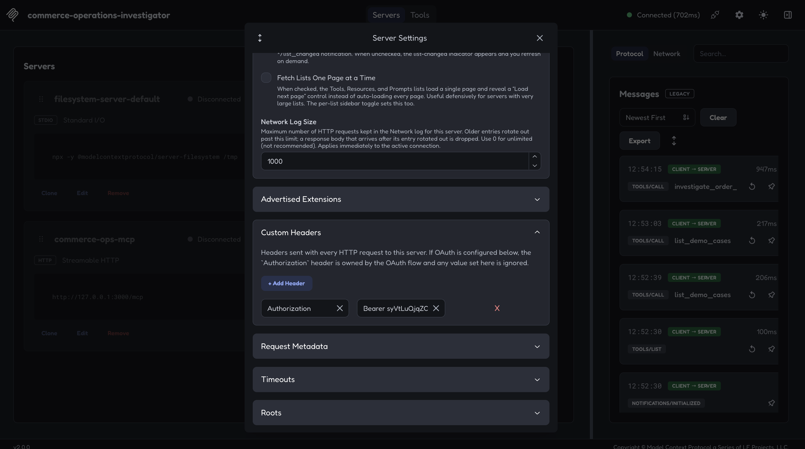
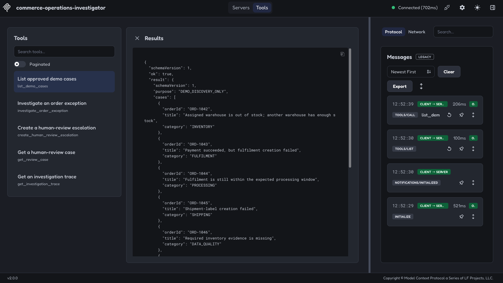
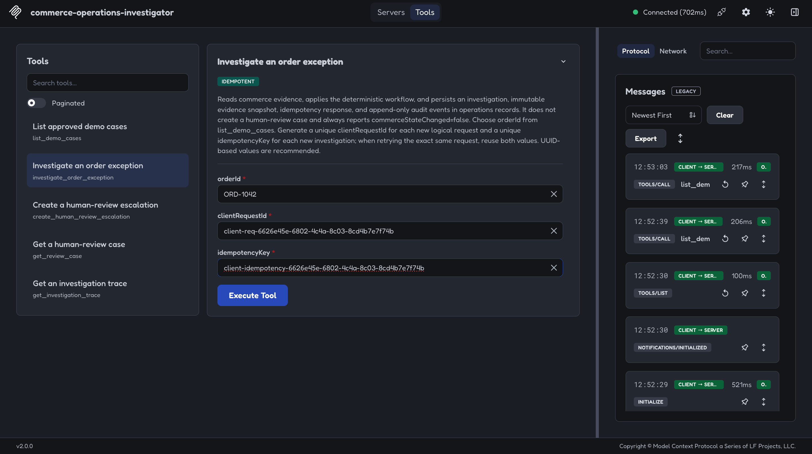
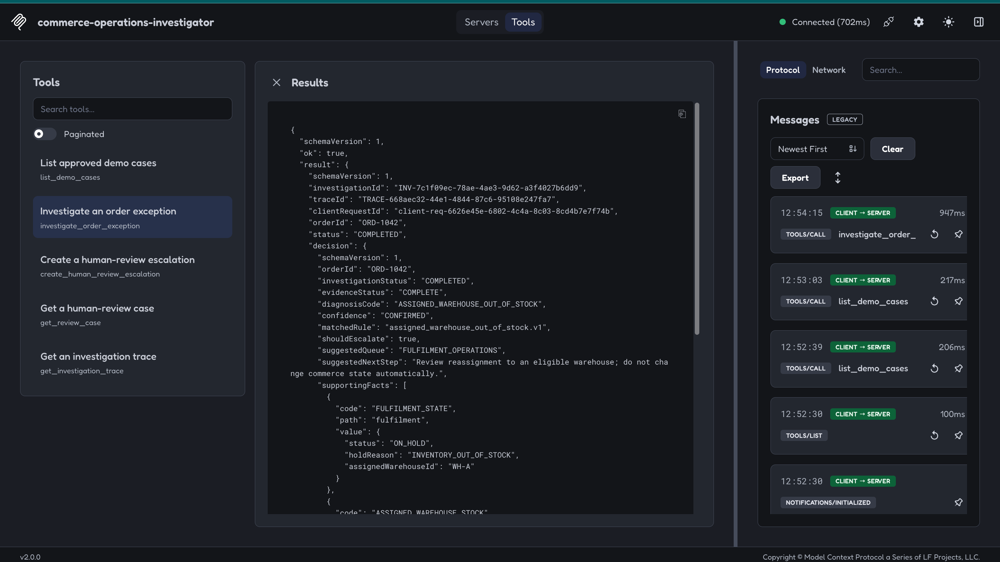
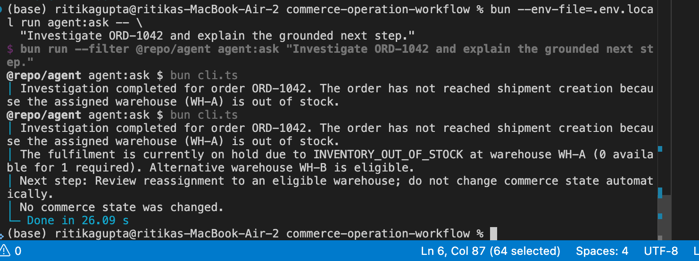
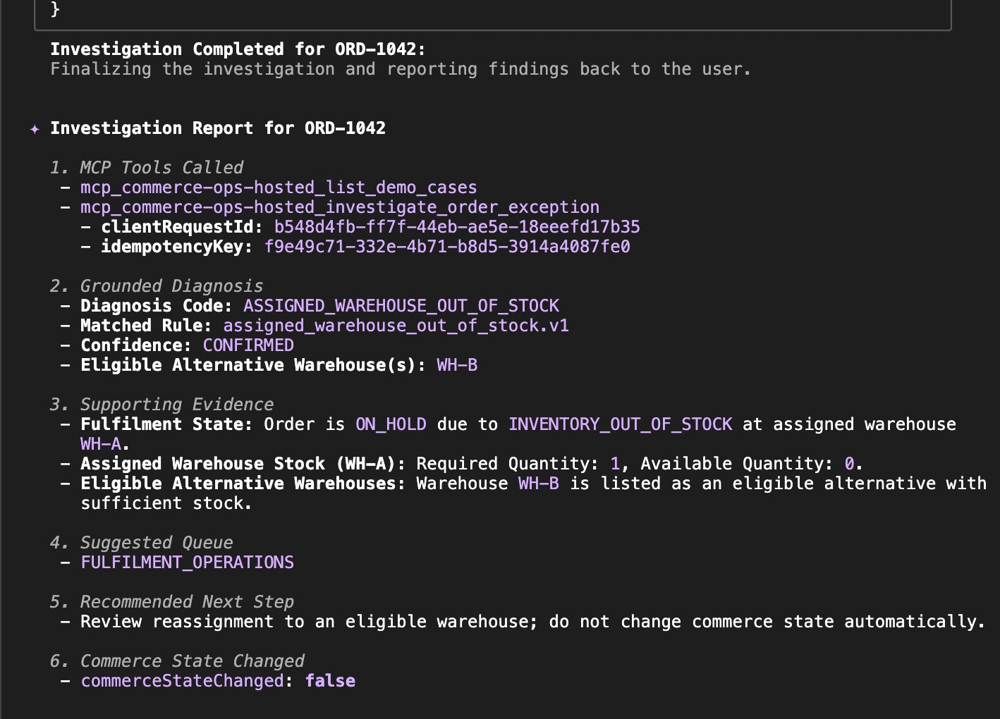

# Final Submission Evidence

This page collects the committed, redacted proof for the hosted MCP workflow, automated evaluation, MCP Inspector, and an independent MCP-compatible AI client.

No bearer token, model-provider key, database URL, SSH material, or complete Authorization header is included.

## Hosted verification report

[Download the Hosted MCP Verification Report](00-hosted-mcp-verification-report.pdf)

The report summarizes the hosted endpoint, exact five-tool surface, Inspector verification, compatible AI-client verification, and `commerceStateChanged=false` result.

## 1. Authenticated MCP Inspector configuration

**Demonstrates:** the public HTTPS `/mcp` endpoint is configured as a Streamable HTTP server with bearer authentication.

## 2. Exact five-tool discovery

**Demonstrates:** successful connection and discovery of exactly:

- `list_demo_cases`
- `investigate_order_exception`
- `create_human_review_escalation`
- `get_review_case`
- `get_investigation_trace`

**Reviewer should notice:** no commerce mutation, SQL, reset, cleanup, or unrestricted HTTP tool is exposed.

## 3. Investigation request

**Demonstrates:** the reviewer can call the hosted investigation tool with `ORD-1042`, a fresh `clientRequestId`, and a fresh `idempotencyKey`.

## 4. Grounded investigation result

**Demonstrates:** the deterministic workflow returned the assigned-warehouse stock issue, eligible alternative warehouse, human-review queue, and `commerceStateChanged=false`.

## 5. Automated hosted model-backed evaluation

**Demonstrates:** all nine approved scenarios were exercised through the model-backed host against the real hosted MCP endpoint while preserving deterministic expectations and commerce immutability.

## 6. Independent MCP-compatible AI client

**Demonstrates:** Gemini CLI independently discovered and used the hosted MCP tools to investigate `ORD-1042` and explain the server-produced result.

**Reviewer should notice:**

- hosted tool calls rather than a memorized answer;
- diagnosis `ASSIGNED_WAREHOUSE_OUT_OF_STOCK`;
- assigned warehouse `WH-A` with zero available stock;
- eligible alternative `WH-B`;
- queue `FULFILMENT_OPERATIONS`;
- human review rather than automatic mutation;
- `commerceStateChanged=false`.

## Reproducibility

The screenshots are supporting visual evidence. Exact testing steps are documented in the [Reviewer Guide](../../reviewer-guide.md), and the layered automated/manual results are summarized in the [Final Evaluation](../../final-evaluation.md).

The images are stored in the repository root [`images/`](../../../images/) directory and referenced with relative paths so they render on GitHub branches and after merge.
